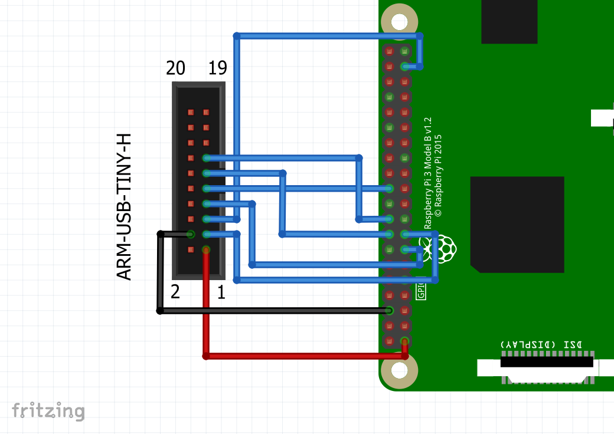

# Tutorial 13 - Using debugger

Debugging with a debugger is very effective, but it's a bit difficult on our Raspberry Pi. 

[The Embedded Rust Book mentions](https://rust-embedded.github.io/book/start/hardware.html) about using debugger on `STM32F3DISCOVERY`, however, there are some differences from our environment. The biggest one is lack of debugger hardware. Unlike `STM32F3DISCOVERY`, Raspberry Pi does not have embedded debugger on it's board; it means we need to get, connect, and setup it.

## Hardware debugger

A debugger `ARM-USB-TINY-H` made by OLIMEX has tested with Raspberry Pi3 and openocd.

https://www.olimex.com/Products/ARM/JTAG/ARM-USB-TINY-H/

It has standard [ARM JTAG 20 connector](http://infocenter.arm.com/help/index.jsp?topic=/com.arm.doc.dui0499dj/BEHEIHCE.html), but unfortunately, Raspberry Pi doesn't; we have to connect like following:

| GPIO# | Name  | JTAG# | Note    |
|-------|-------|-------|---------|
|       | VTREF | 1     | to 3.3V |
|       | GND   | 4     | to GND  |
| 22    | TRST  | 3     |         |
| 26    | TDI   | 5     |         |
| 27    | TMS   | 7     |         |
| 25    | TCK   | 9     |         |
| 23    | RTCK  | 11    |         |
| 24    | TDO   | 13    |         |




## debugger.rs

And, GPIO pins have to be changed to alternative functions. In this tutorial, `debugger.rs` sets the pins JTAG functions(all of them are assigned to Alt4) from the default.

```rust
pub fn setup_debug() {
    unsafe {
        (*GPFSEL2).modify(
            GPFSEL2::FSEL27::Alt4
                + GPFSEL2::FSEL26::Alt4
                + GPFSEL2::FSEL25::Alt4
                + GPFSEL2::FSEL24::Alt4
                + GPFSEL2::FSEL23::Alt4
                + GPFSEL2::FSEL22::Alt4,
        );
    }
}
```

## main.rs

After enabling debugger, it goes empty loop to wait debugger connection.

## Running debugger on Linux with Docker

Using pre-built docker image like following command is easier way. This is tested on Ubuntu18.04.

Note that a device you have to specify in this command (`--device=XXX`) may be attached on different point on your machine. You can find it on `syslog` after you connect the debugger to your PC. It's like `/dev/ttyUSB0` on Ubuntu.

```console
$ sudo docker run -p 3333:3333 -p 4444:4444 --rm --privileged --device=/dev/ttyUSB0 naotaco/openocd:armv8 /bin/sh -c "cd openocd-armv8 && openocd -f tcl/interface/ftdi/olimex-arm-usb-tiny-h.cfg -f tcl/target/rpi3.cfg"

Open On-Chip Debugger 0.9.0-dev-gb796a58 (2019-02-19-01:36)
Licensed under GNU GPL v2
For bug reports, read
        http://openocd.sourceforge.net/doc/doxygen/bugs.html
trst_and_srst separate srst_gates_jtag trst_push_pull srst_open_drain connect_deassert_srst
adapter speed: 1000 kHz
jtag_ntrst_delay: 500
Info : clock speed 1000 kHz
Info : JTAG tap: rpi3.dap tap/device found: 0x4ba00477 (mfg: 0x23b, part: 0xba00, ver: 0x4)
Info : rpi3.cpu: hardware has 6 breakpoints, 4 watchpoints
Info : rpi3.cpu1: hardware has 6 breakpoints, 4 watchpoints
Info : rpi3.cpu2: hardware has 6 breakpoints, 4 watchpoints
Info : rpi3.cpu3: hardware has 6 breakpoints, 4 watchpoints
```

Then, from another console, use telnet to connect to openocd. Type `targets` to show status.

```console
$ telnet localhost 4444
Trying ::1...
Connection failed: Connection refused
Trying 127.0.0.1...
Connected to localhost.
Escape character is '^]'.
Open On-Chip Debugger
> targets
    TargetName         Type       Endian TapName            State
--  ------------------ ---------- ------ ------------------ ------------
 0  rpi3.cpu           aarch64    little rpi3.dap           running
 1  rpi3.cpu1          aarch64    little rpi3.dap           running
 2  rpi3.cpu2          aarch64    little rpi3.dap           running
 3* rpi3.cpu3          aarch64    little rpi3.dap           running
```

If the Raspberry Pi is running and configured correctly, `State` will be `running`.

You can change target cpu and break it.

```console
> targets rpi3.cpu # switch to core0
> halt # stop CPU
number of cache level 2
cache l2 present :not supported
rpi3.cpu cluster 0 core 0 multi core
target state: halted
target halted in ARM64 state due to debug-request, current mode: EL2H
cpsr: 0x600003c9 pc: 0x8004c
MMU: disabled, D-Cache: disabled, I-Cache: disabled
> reg # show registers
===== arm v8 registers
(0) x0 (/64): 0x0000000000000000 (dirty)
(1) x1 (/64): 0x0000000000080000
...
(29) x29 (/64): 0xE55C2E08279A78D0
(30) x30 (/64): 0x0000000000080080
(31) sp (/64): 0x0000000000080000
(32) pc (/64): 0x000000000008004C
(33) CPSR (/32): 0x600003C9
```

In this timing, value of `pc` may point an address of the empty loop.


## Build/setup openocd directly

Alternatively, you can build openocd to install to your local machine.

### Installing Openocd on Ubuntu 18.04

Unfortunately, openocd from apt on Ubuntu 18.04 does not support ARMv8; we need to build it.

```bash
sudo apt install build-essential automake libtool libudev-dev pkg-config libusb-1.0-0-dev gcc-6
git clone https://github.com/daniel-k/openocd.git openocd-armv8
cd openocd-armv8
git checkout origin/armv8
./bootstrap
CC=gcc-6 ./configure --enable-ftdi
# Error on gcc 7.3
make
sudo make install
```

### Running debugger

```console
# go to the repository you built to find config files
$ cd openocd-armv8
$ sudo openocd -f tcl/interface/ftdi/olimex-arm-usb-tiny-h.cfg -f tcl/target/rpi3.cfg
```

Now it waits connection at 3333/4444; you can connect as same as when using docker.
